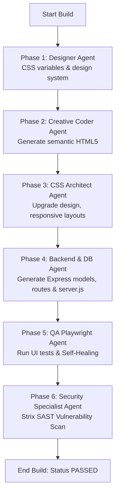

# 🤖 Web AI Platform (Multi-Agent, Skills & PO Toolkits)

Nền tảng đa tác nhân (Multi-Agent System) tổng quát phục vụ phát triển phần mềm, đóng gói các năng lực của Agent thành các **MCP Skills** độc lập, tích hợp quản lý dự án Product Owner chuyên nghiệp, tự động sinh code Fullstack (Frontend & Node.js Backend), kiểm thử Playwright tự động và rà quét bảo mật SAST.

Dự án được cấu trúc theo mô hình **Monorepo** phân rã rõ ràng giữa lõi xử lý (Core Platform), các kỹ năng (MCP Skills) và ứng dụng cụ thể (Apps).

---

## 📁 Cấu trúc Thư mục Monorepo

```text
d:/ai-web-skill/
├── core/                         # Thư viện lõi & SDK đa tác nhân
│   ├── coordinator/              # AgentCoordinator điều phối tổng quát
│   │   └── base.py               # Định nghĩa lớp GenericCoordinator và AgentPersona cơ bản
│   ├── skill_sdk/                # SDK đóng gói MCP Skill Server cực kỳ nhanh chóng
│   │   └── server.py             # SkillServer dùng FastMCP tích hợp decorator @tool
│   └── llm/                      # Client kết nối LLM (Gemini, DeepSeek)
│       └── client.py             # Client tích hợp Gemini SDK và OpenAI API (cho DeepSeek)
├── skills/                       # Các MCP Skill Server độc lập giao tiếp qua STDIO/HTTP
│   ├── html_coder/               # Skill sinh mã HTML5 ngữ nghĩa và gán ID kiểm thử
│   │   └── server.py             # MCP Server phơi tool `generate_html`
│   ├── css_expert/               # Skill thiết kế theme và CSS Grid/Flexbox responsive
│   │   └── server.py             # MCP Server phơi tool `generate_css_variables`, `upgrade_css_styles`
│   ├── backend_generator/        # Skill tạo cơ sở dữ liệu và API Express/Mongoose
│   │   └── server.py             # MCP Server phơi tool `generate_backend`
│   ├── qa_playwright/            # Skill chạy test UI tự động & chẩn đoán lỗi console
│   │   └── server.py             # MCP Server phơi tool `verify_ui`, `scan_security`
│   └── po_toolkit/               # Bộ skill dành riêng cho Product Owner
│       └── server.py             # MCP Server phơi tool `generate_user_story`, `prioritize_backlog`, ...
├── agents/                       # Cấu hình hành vi các Agent
├── apps/                         # Thư mục chứa các ứng dụng nghiệp vụ
│   ├── web_creator/              # Backend FastAPI & Celery Worker hiện tại
│   │   ├── app/
│   │   │   ├── agents/           # Module điều phối Agent tích hợp
│   │   │   │   ├── coordinator.py# Điều phối quy trình build 6 Pha & Self-Healing
│   │   │   │   └── personas.py   # Định nghĩa chỉ thị hệ thống cho từng Agent
│   │   │   ├── db/               # SQLAlchemy models lưu trữ thông tin hệ thống & PO
│   │   │   │   ├── database.py   # Cấu hình SQLite engine và session
│   │   │   │   └── models.py     # Định nghĩa cấu trúc bảng CSDL
│   │   │   ├── mcp/              # Tích hợp MCP Client
│   │   │   ├── main.py           # FastAPI REST API endpoints phục vụ Client & PO
│   │   │   └── worker.py         # Celery task chạy ngầm cho tiến trình build dài hạn
│   │   ├── cli.py                # CLI điều hành ứng dụng
│   │   └── Dockerfile
│   └── po_dashboard/             # [MỚI] Frontend Next.js cho PO Dashboard (Đang phát triển)
└── tests/                        # Kiểm thử hệ thống
```

---

## ⚙️ Các Phân Hệ Lõi (Core Components)

### 1. Skill SDK ([core/skill_sdk/server.py](file:///d:/ai-web-skill/core/skill_sdk/server.py))
Cung cấp bộ công cụ giúp đóng gói bất kỳ logic tác nhân hoặc hàm xử lý Python nào thành một MCP Server chuẩn chỉnh chỉ với một decorator `@tool`:
```python
from core.skill_sdk import SkillServer, tool

server = SkillServer("my-mcp-skill")

@tool
def my_custom_capability(param: str) -> str:
    # Logic xử lý của Agent
    return "result"

server.run(transport="stdio")
```

### 2. LLM Client ([core/llm/client.py](file:///d:/ai-web-skill/core/llm/client.py))
Trình bao bọc (Wrapper) hợp nhất hỗ trợ cả **Gemini** (thông qua SDK chính thức) và **DeepSeek/OpenAI** (thông qua API cấu hình tùy chỉnh).
* **Cơ chế Fallback thông minh**: Khi một cuộc gọi API bất đồng bộ (`async`) thất bại do sự cố mạng, client tự động kích hoạt cuộc gọi đồng bộ (`sync`) để đảm bảo hệ thống không bị ngắt quãng.
* **Hỗ trợ System Instruction**: Cho phép gán chỉ thị hệ thống sâu cho từng Agent khi khởi tạo.

### 3. Agent Coordinator ([core/coordinator/base.py](file:///d:/ai-web-skill/core/coordinator/base.py))
Bộ điều phối đa tác nhân tổng quát. Lớp `GenericCoordinator` quản lý việc đăng ký các `AgentPersona` và giao tiếp linh hoạt, điều hành luồng bàn giao kết quả (Handoff) qua các pha.

---

## 🛠️ Bộ Công Cụ Product Owner (`skills/po_toolkit/`)

Bộ công cụ này cung cấp các công cụ MCP Tool độc lập chạy qua STDIO, cho phép Product Owner (PO) tự động hóa quy trình quản trị backlog và lập kế hoạch phát triển:

### 1. `generate_user_story`
* **Mô tả**: Đọc tài liệu yêu cầu (Word `.docx` hoặc văn bản thô) để tự động sinh ra danh sách User Stories chuẩn định dạng Agile.
* **Đầu vào**: `requirement` (str) - Tài liệu mô tả yêu cầu từ khách hàng.
* **Đầu ra**: Mảng JSON chứa các đối tượng User Story:
  ```json
  [
    {
      "Title": "Đăng ký tài khoản mới",
      "Persona": "Khách vãng lai",
      "Want": "đăng ký tài khoản qua email",
      "Benefit": "tôi có thể đăng nhập và lưu giỏ hàng của mình",
      "AcceptanceCriteria": [
        "Given email chưa tồn tại, khi gửi đúng định dạng thì tài khoản được tạo.",
        "Then hệ thống gửi email kích hoạt."
      ]
    }
  ]
  ```

### 2. `prioritize_backlog`
* **Mô tả**: Phân tích độ ưu tiên dựa trên giá trị kinh doanh (Business Value) và rủi ro kỹ thuật (Technical Risk), sử dụng phương pháp **MoSCoW**.
* **Đầu vào**: `backlog_json` (str) - Chuỗi JSON chứa danh sách User Stories.
* **Đầu ra**: Mảng JSON đã sắp xếp độ ưu tiên với các thuộc tính bổ sung: `Priority` (Must/Should/Could/Won't), `BusinessValue` (1-10), `TechnicalRisk` (1-10), `Rationale`.

### 3. `estimate_effort`
* **Mô tả**: Ước lượng Story Points theo dãy số Fibonacci (1, 2, 3, 5, 8, 13) kèm giải trình độ phức tạp.
* **Đầu vào**: `stories_json` (str) - Chuỗi JSON chứa các stories đã phân độ ưu tiên.
* **Đầu ra**: Mảng JSON kèm trường `StoryPoints` và `ComplexityRationale`.

### 4. `breakdown_tasks`
* **Mô tả**: Phân rã một User Story cụ thể thành các task kỹ thuật chi tiết dành cho lập trình viên thuộc các phân nhóm: Database, API, Frontend, QA.
* **Đầu vào**: `story_json` (str) - JSON của một User Story duy nhất.
* **Đầu ra**: Mảng JSON chứa danh sách Task:
  ```json
  [
    {
      "Type": "Database",
      "TaskName": "Tạo bảng User",
      "Description": "Thiết kế schema và trường dữ liệu email, password, status",
      "EstimatedHours": 2
    }
  ]
  ```

---

## 💾 Cơ Sở Dữ Liệu & REST API hỗ trợ PO

Hệ thống cơ sở dữ liệu SQLite (`web_creator.db`) được tích hợp sẵn để quản lý chu kỳ sống của các dự án và Sprint của Product Owner.

### Sơ đồ Thực thể (SQLAlchemy Models)
* **`Project`**: Lưu trữ thông tin dự án, chủ đề (theme), trạng thái hiện tại (`INIT`, `PLANNING`, `BUILDING`, `PASSED`, `FAILED`).
* **`BuildTask`**: Theo dõi tiến độ thực thi các pha dựng mã nguồn của hệ thống đa tác nhân.
* **`TestRun` & `SecurityScan`**: Ghi nhận lịch sử kiểm thử Playwright và rà quét lỗ hổng Strix.
* **`Sprint`**: Quản lý các chu kỳ Sprint bao gồm tên, mục tiêu (goal), ngày bắt đầu/kết thúc và trạng thái (`planning`, `active`, `completed`).
* **`UserStory`**: Lưu trữ các câu chuyện người dùng, độ ưu tiên MoSCoW, Story Points, giá trị kinh doanh và liên kết với Sprint.
* **`DevTask`**: Các đầu việc kỹ thuật cụ thể phân rã từ câu chuyện người dùng.

### Danh sách REST API Endpoints ([apps/web_creator/app/main.py](file:///d:/ai-web-skill/apps/web_creator/app/main.py))

| Endpoint | Method | Mô tả | Body / Tham số |
|----------|--------|-------|----------------|
| `/api/project/init` | `POST` | Khởi tạo dự án và tạo tài liệu đặc tả ban đầu (`PROJECT.md`, `ROADMAP.md`, `STATE.md`) từ file `.docx` hoặc mô tả ngắn. | `{ "name": "...", "concept": "...", "workspace_path": "..." }` |
| `/api/project/build/{project_id}` | `POST` | Đưa dự án vào hàng đợi build ngầm (Celery worker). Trạng thái dự án chuyển sang `QUEUED`. | `project_id` |
| `/api/project/{project_id}/status` | `GET` | Lấy chi tiết trạng thái dự án, tiến độ hoàn thành các pha build, và các báo cáo test/security mới nhất. | `project_id` |
| `/api/project/forensics/{project_id}` | `POST` | Chạy lại tiến trình chẩn đoán lỗi console và tự sửa chữa trực tiếp trên mã nguồn của dự án. | `project_id` |
| `/api/po/stories/generate` | `POST` | Gọi PO Agent phân tích spec dự án để tự động sinh User Stories và lưu vào CSDL. | `{ "project_id": "..." }` |
| `/api/po/projects/{project_id}/stories` | `GET` | Truy xuất toàn bộ danh sách User Stories (backlog) của dự án. | `project_id` |
| `/api/po/stories/prioritize-estimate` | `POST` | Tự động cập nhật độ ưu tiên MoSCoW và Story Points cho toàn bộ câu chuyện người dùng của dự án. | `{ "project_id": "..." }` |
| `/api/po/stories/{story_id}/breakdown` | `POST` | Phân rã User Story thành danh sách việc lập trình (`DevTask`) và lưu vào CSDL. | `story_id` |
| `/api/po/projects/{project_id}/sprints` | `POST` | Tạo mới một Sprint cho dự án. | `{ "name": "...", "goal": "...", "start_date": "...", "end_date": "..." }` |
| `/api/po/projects/{project_id}/sprints` | `GET` | Lấy danh sách Sprints của dự án. | `project_id` |
| `/api/po/sprints/{sprint_id}/add-story/{story_id}` | `POST` | Gán một User Story từ backlog vào Sprint đã chọn và chuyển trạng thái story sang `todo`. | `sprint_id`, `story_id` |

---

## 🔄 Quy Trình Tác Nhân Xây Dựng Tự Động (Web Creator Workflow)

Khi tiến trình build được kích hoạt, `AgentCoordinator` sẽ thực thi tuần tự 6 Pha thông qua sự phối hợp của các tác nhân chuyên biệt:



### 🛠️ Cơ chế Tự sửa lỗi (Self-Healing Loop) tại Phase 5
1. Hệ thống sao chép file kịch bản kiểm thử [verify-ui.js](file:///d:/ai-web-skill/apps/web_creator/app/agents/coordinator.py#L297) vào thư mục dự án mục tiêu.
2. Thực thi script thông qua Playwright.
3. Nếu phát hiện lỗi (console crash, thiếu thẻ HTML, sai liên kết CSS), lỗi được chuyển cho **Forensics Agent** để chẩn đoán.
4. Forensics Agent tự động phân tích logs lỗi, dựng bản vá và ghi đè trực tiếp lên file lỗi.
5. Tiến hành chạy lại kiểm thử. Quá trình lặp lại tối đa 3 lần. Nếu lỗi vẫn tồn tại sau 3 lần sửa, hệ thống sẽ đánh dấu build thất bại.

### 🛡️ Rà quét Bảo mật (Phase 6)
* Hệ thống sẽ cố gắng gọi lệnh **Strix CLI** để thực hiện quét tĩnh mã nguồn (`strix --target . --non-interactive --scan-mode quick`).
* Nếu Strix CLI không khả dụng trên môi trường, hệ thống tự động chuyển đổi sang **AI Security Agent fallback** (được cung cấp chỉ thị chuyên sâu về bảo mật ứng dụng) để phân tích mã nguồn và xuất báo cáo lỗ hổng chi tiết dưới định dạng Markdown lưu tại dự án mục tiêu.

---

## 🎨 Quy Tắc Cứng: Tách Biệt Hoàn Toàn CSS và HTML

Để duy trì chất lượng mã nguồn cao và cấu trúc chuẩn hóa cho dự án, các Agent tuân thủ nghiêm ngặt nguyên tắc:
* **Không sử dụng Inline CSS** (ví dụ: `style="color: red;"` là cấm kỵ).
* **Không khai báo thẻ `<style>`** bên trong các file HTML.
* Coder Agent chỉ viết khung HTML chuẩn ngữ nghĩa kèm các `class` và `id` rõ ràng.
* CSS Architect Agent gom toàn bộ mã CSS vào các file stylesheet riêng biệt nằm trong thư mục tài sản tĩnh (ví dụ: `public/css/style.css`, `public/css/dashboard.css`) và được nhúng vào HTML qua thẻ `<link>`.
* Áp dụng hệ thiết kế thống nhất (ví dụ: theme Obsidian Rose Gold, phông chữ Outfit/Inter từ Google Fonts, các hiệu ứng hover, glassmorphism với giá trị blur/opacity rõ ràng).

---

## ⚡ Hướng Dẫn Khởi Chạy & Sử Dụng

### 1. Cài đặt môi trường
Tạo file `.env` từ file `.env.example` và điền đầy đủ thông tin API Key (Gemini hoặc DeepSeek). Sau đó chạy cài đặt:
```bash
# Cài đặt thư viện Python
pip install -r requirements.txt

# Cài đặt trình duyệt chạy Playwright UI
npx playwright install chromium
```

### 2. Khởi chạy các MCP Skill Server độc lập
Bạn có thể khởi động bất cứ Server nào trong thư mục `skills/` để kiểm tra hoặc chia sẻ công cụ với các trình soạn thảo hỗ trợ MCP (như Cursor):
```bash
# Ví dụ chạy PO Toolkit qua giao thức STDIO
python skills/po_toolkit/server.py

# Ví dụ chạy QA Playwright qua STDIO
python skills/qa_playwright/server.py
```

### 3. Chạy Ứng Dụng FastAPI REST API & Worker
Để sử dụng đầy đủ các tính năng lập kế hoạch cho PO và tiến hành build ngầm qua Celery, bạn cần mở 3 tab terminal riêng biệt:

* **Tab 1: Khởi động Redis** (Cần thiết làm Message Broker cho Celery).
* **Tab 2: Khởi động FastAPI HTTP Server**:
  ```bash
  python cli.py serve --port 8000
  ```
  Tài liệu tương tác Swagger đầy đủ có thể truy cập tại: `http://localhost:8000/docs`

* **Tab 3: Khởi động Celery Worker**:
  ```bash
  python cli.py worker
  ```

### 4. Chạy xây dựng trực tiếp qua dòng lệnh (CLI Direct Build)
Bạn cũng có thể bỏ qua Web Server và kích hoạt trực tiếp tiến trình build đa tác nhân qua CLI:
```bash
# Xây dựng từ file tài liệu spec
python cli.py build "BeautyStore" "d:/ai-web-skill/yeucau.docx" --workspace "d:/ai-web-skill/projects/beautystore"

# Xây dựng từ mô tả văn bản trực tiếp
python cli.py build "MySaaS" "A landing page for a SaaS product showcasing glassmorphic layout and dark mode" --workspace "d:/ai-web-skill/projects/mysaas"
```

---

## 🚀 Chạy Tự Hành Với Gemini CLI (YOLO Mode)
Nếu bạn có cài đặt `gemini-cli`, bạn có thể ra lệnh trực tiếp cho AI thực thi các lệnh nghiệp vụ thông qua các lệnh tắt:
```powershell
# Thực hiện dựng mã nguồn nhanh từ file Word yêu cầu ở chế độ YOLO
gemini --skip-trust --approval-mode=yolo -p "/web-creator build yeucau.docx"

# Chạy chẩn đoán sửa lỗi forensics dự án hiện tại
gemini --skip-trust --approval-mode=yolo -p "/web-creator forensics"
```
*(Để tìm hiểu thêm về các lệnh nhanh và tham số nâng cao, hãy xem thêm ở tài liệu [QUICKSTART.md](file:///d:/ai-web-skill/QUICKSTART.md)).*
